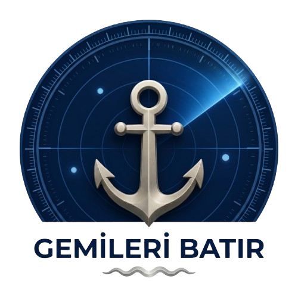
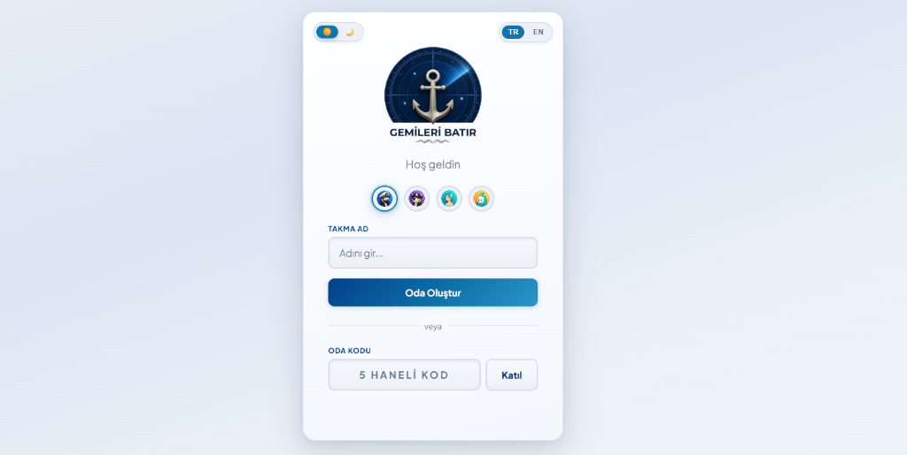
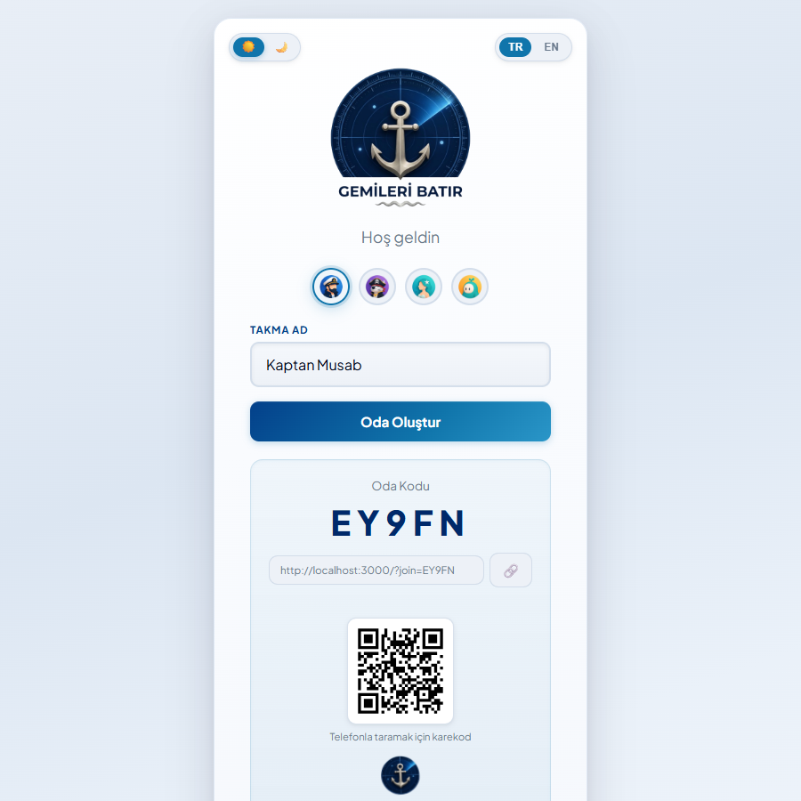
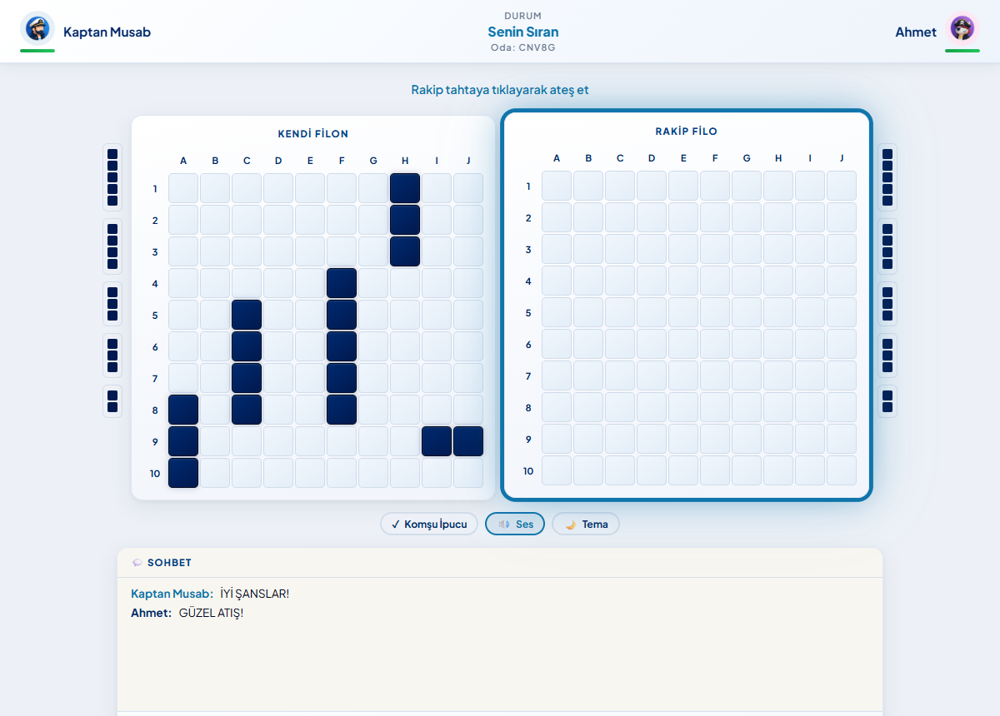
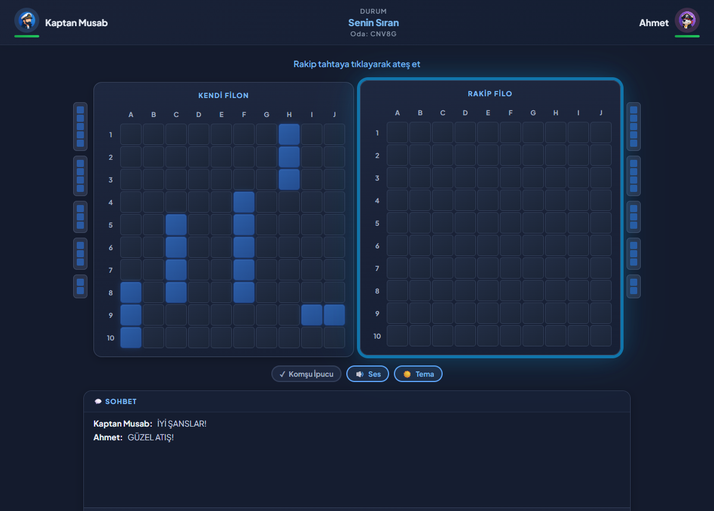
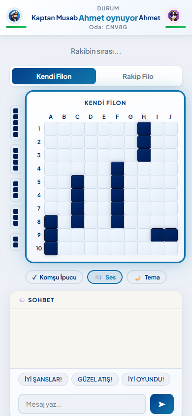

<div align="center">



### Arkadaşınla saniyeler içinde başlayabileceğin gerçek zamanlı çok oyunculu Amiral Battı oyunu.

**🎮 [gemileribatir.onrender.com](https://gemileribatir.onrender.com) — hemen oyna**

</div>

---

## Gemileri Batır

İnternette arkadaşlarımla hızlıca oynayabileceğim akıcı ve göze hitap eden bir arayüze sahip bir Amiral Battı oyunu aradım ama bulamadım, bulduklarım ya reklamlarla doluydu ya arayüzü on yıllık kalmıştı ya da bir arkadaşı davet etmek üç dört adım gerektiriyordu. Ben de daha akıcı bir arayüze ve kullanıcı dostu olan bir versiyonunu yapmak istedim.


## Ekran Görüntüleri

<table>
<tr>
<td width="50%"></td>
<td width="50%"></td>
</tr>
<tr>
<td align="center"><sub>Lobi — takma ad, avatar seçimi, oda oluştur/katıl</sub></td>
<td align="center"><sub>Davet linki + otomatik oluşan karekod</sub></td>
</tr>
<tr>
<td width="50%"></td>
<td width="50%"></td>
</tr>
<tr>
<td align="center"><sub>Savaş ekranı — açık tema</sub></td>
<td align="center"><sub>Savaş ekranı — koyu tema</sub></td>
</tr>
</table>

<div align="center">

<br><sub>Mobil uyumlu tab arayüzü ve oyun içi sohbet</sub>
</div>

## Özellikler

- 🔴 **Gerçek zamanlı çok oyunculu** — Socket.IO ile anlık senkronize oyun, sunucu taraflı doğrulama (hile yapılamaz)
- 🔗 **Tek tıkla davet** — 5 haneli oda kodu, paylaşılabilir link ve otomatik oluşan **karekod** ile telefondan anında katıl
- 🖱️ **Sürükle-bırak gemi yerleştirme** — döndürme, rastgele yerleştirme, komşu hücre çakışma kontrolü
- 🎯 **Komşu ipucu modu** — batırdığın geminin etrafındaki hücreleri otomatik işaretler
- 💬 **Oyun içi sohbet** — serbest mesaj + hazır mesaj butonları, mobilde okunmamış mesaj bildirimi
- ❤️ **HP barları ve canlı istatistikler** — isabet, ıska, oran, süre (sayaç animasyonlu)
- 🌗 **Açık / koyu tema**
- 🇹🇷 🇬🇧 **Türkçe / İngilizce dil desteği**
- 🔊 Açılıp kapatılabilir ses efektleri
- 🔁 **Yeniden oyna** — aynı odada tek tıkla revanş
- 📶 **Bağlantı toparlama** — sayfa yenilense ya da internet kısa süreliğine kesilse bile tahtalar, atışlar ve sıra korunarak oyuna kaldığı yerden devam edilir
- 📱 **Mobil uyumlu** — tek elle oynanabilir, tab tabanlı düzen
- 🎭 4 özel tasarım avatar

## Avatarlar

Oyundaki 4 avatarı da kendim tasarladım:

<p>
   
</p>

## Nasıl Oynanır

1. Bir takma ad yaz ve avatarını seç.
2. **Oda Oluştur**'a bas; çıkan 5 haneli kodu, linki ya da karekodu arkadaşına gönder.
3. Arkadaşın odaya katılınca ikiniz de 5 geminizi tahtaya yerleştirin (sürükle-bırak, tıklayıp döndürme veya "Rastgele").
4. **Hazırım**'a basınca savaş başlar — sırayla rakip tahtasına ateş edersiniz, isabet ettiğinizde sıra sizde kalır.
5. Rakibinin tüm gemilerini ilk batıran kazanır. **Yeniden Oyna** ile aynı odada tekrar oynayabilirsiniz.

## Teknolojiler

| Katman | Kullanılanlar |
|---|---|
| Sunucu | Node.js, Express, Socket.IO (WebSocket) |
| İstemci | Vanilla JavaScript, HTML5, CSS3 — framework/derleyici yok, sade ve hızlı |
| Diğer | [qrcode-generator](https://github.com/kazuhikoarase/qrcode-generator) (davet karekodu) |
| Barındırma | [Render](https://render.com) |

Oyun mantığının tamamı (gemi yerleşim doğrulama, atış, sıra kontrolü, kazanan tespiti) **sunucu tarafında** çalışır; istemci yalnızca arayüzü yönetir.

## Yerel Kurulum

```bash
git clone https://github.com/MusaBarutcu/battleship-game.git
cd battleship-game
npm install
npm start
```

Sonra tarayıcıda `http://localhost:3000` adresini aç. İkinci bir oyuncuyu test etmek için aynı adresi ikinci bir sekmede/tarayıcıda aç.

## Proje Yapısı

```
├── server.js          # Oyun mantığı, oda/oturum yönetimi, Socket.IO event'leri
├── public/
│   ├── index.html
│   ├── game.js         # İstemci mantığı, i18n, animasyonlar, bağlantı toparlama
│   ├── style.css
│   ├── qrcode.js        # Davet karekodu için istemci kütüphanesi
│   └── avatar1-4.png     # Özel tasarım avatarlar
```

---

<div align="center"><sub>Arkadaşlarınla hızlıca bir tur atmak için: <a href="https://gemileribatir.onrender.com">gemileribatir.onrender.com</a></sub></div>
